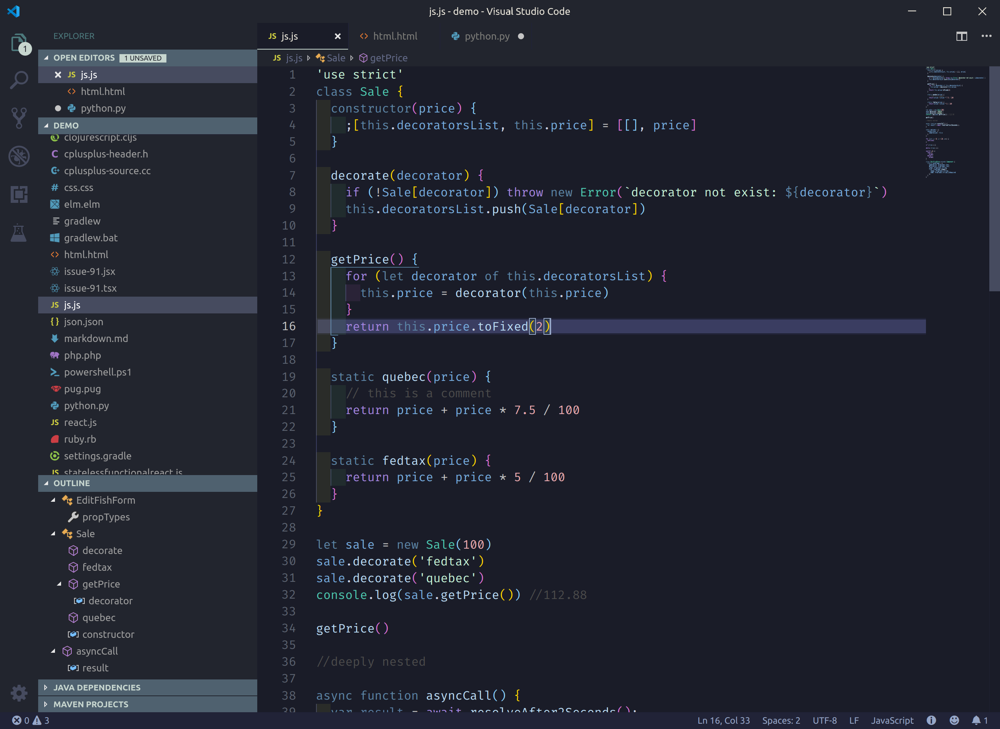

# Nyx

A dark theme inspired by the goddess of the night.

## Installation

Search for the theme in VSCode's Extensions section.

**OR**

Use the install button [on this page](https://marketplace.visualstudio.com/items?itemName=iambenzo.nyx-theme).

**OR**

Install/Extract the [Release](https://github.com/iambenzo/vscode-theme-nyx/releases) into the following directory:

* Windows `%USERPROFILE%\.vscode\extensions`
* macOS `~/.vscode/extensions`
* Linux `~/.vscode/extensions`

## Credits

* Syntax colours based on [Pathtrk's Ariake](https://github.com/pathtrk/ariake-dark-syntax)